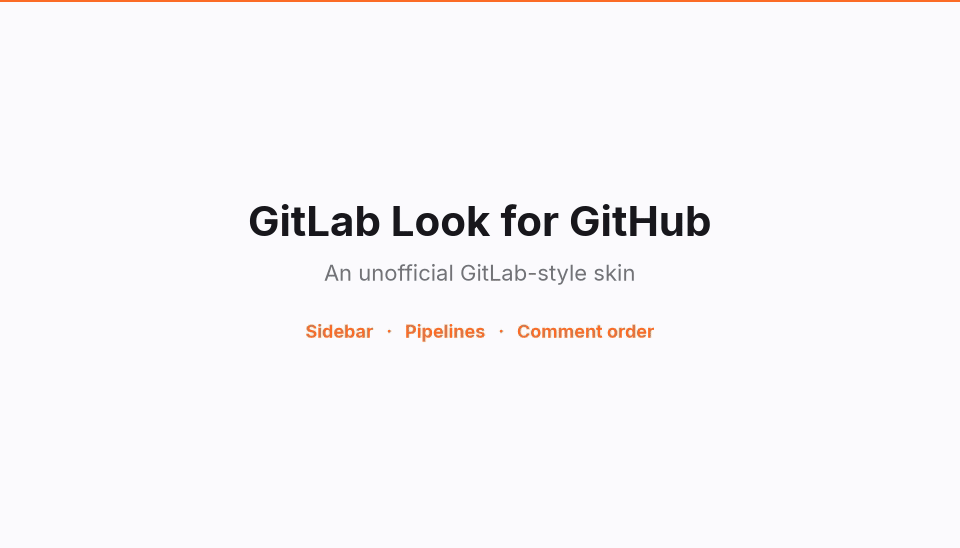
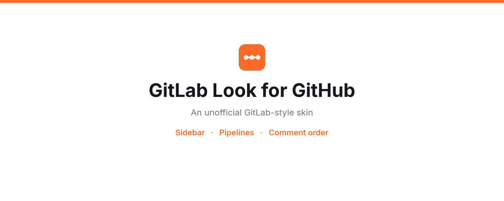
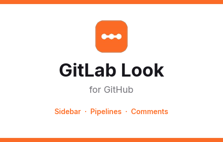
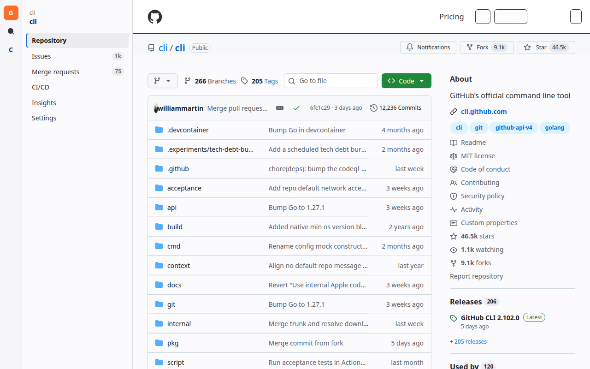
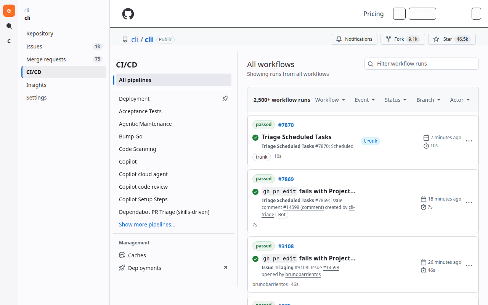
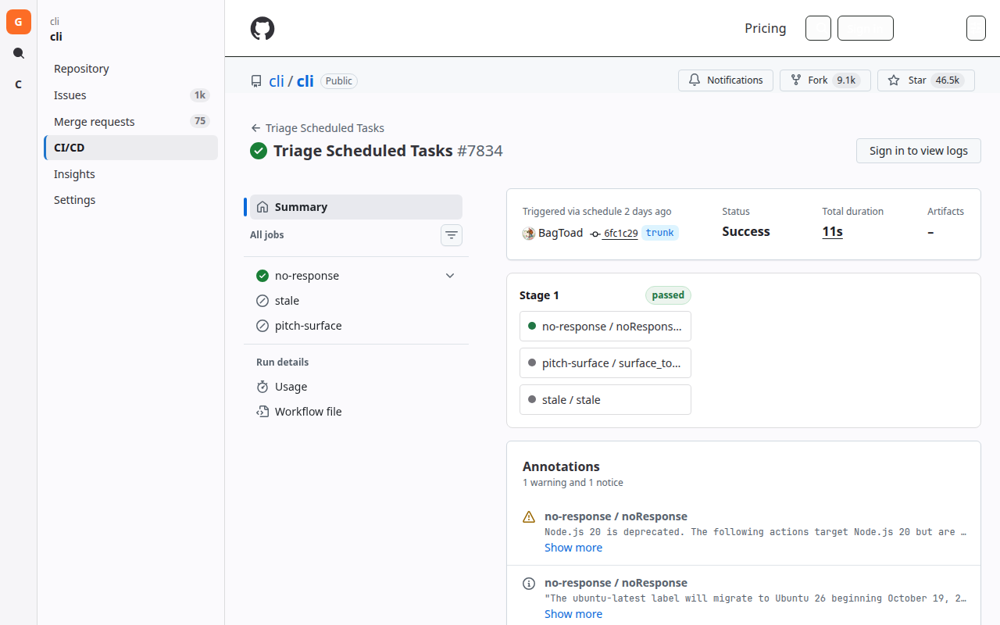
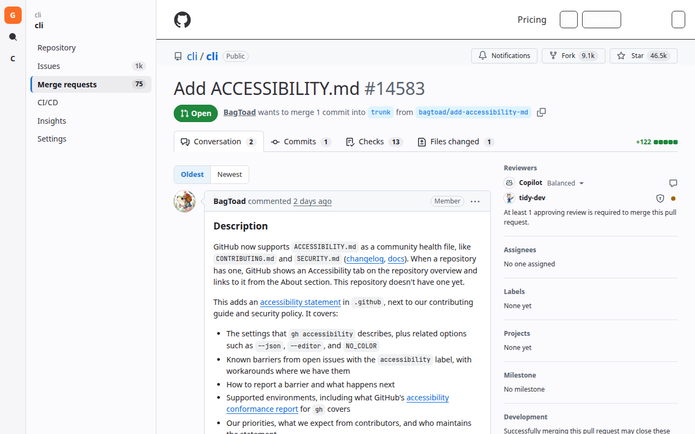

# GitLab Look for GitHub







## Screenshots

These are github.com/cli/cli with the skin on. Each image is 1280 by 800.









## Product description

GitLab Look for GitHub is a Maturity Builder GitLab Overlay skin. It shows [github.com](https://github.com) in a GitLab-style layout, focusing information around security and workflow efficiency. GitHub links, forms, and data stay as they are.

Repository pages use a sidebar instead of the horizontal tabs. Issues and merge requests keep the counts GitHub already shows. Visible "Pull request" headings read as "Merge request," and "Actions" reads as "CI/CD."

The overlay keeps workflow details close at hand: GitHub Actions lists appear as pipeline rows, a workflow run appears as stage columns, and a merge request Checks tab keeps GitHub's job list on the left with GitLab pipeline cards on the right. Open Dependabot findings are listed in a Security console on the merge request. Oldest and Newest reorder a pull request conversation. Security information is brought onto the same pages: open Dependabot alerts are highlighted in dependency files and job logs. Dismissed alerts are left alone. Those details stay in the browser.

The skin is on by default. The toolbar popup turns it off. This project is not affiliated with GitLab or GitHub.

## What it changes

- Light content surface, blue primary actions, and an orange accent, using colors from GitLab's Pajamas palette.
- A fixed super sidebar on repository pages: Repository, Issues, Merge requests, CI/CD, Wiki (when the repo has one), Insights, and Settings. Issues and Merge requests show the same counts GitHub already puts on those tabs. The horizontal repository tabs are hidden while the skin is on.
- Visible headings that say "Pull request" or "Pull requests" display as "Merge request" or "Merge requests".
- GitHub Actions lists render as pipeline rows (status, pipeline number, commit link, branch, actor, duration). A workflow run renders as stage columns. Job names that share a prefix such as `test / node 18` share a stage. The job log page gets a GitLab-style header and a link back to `Pipeline #<id>`. Log text is unchanged. Rerun and cancel stay GitHub's controls.
- On a merge request **Checks** tab, workflows render as GitLab pipelines in the **right-hand column**. Each check suite is a pipeline card with a status badge, pipeline number, and a stage mini-graph. The native job list stays on the left. Jobs named `build (ubuntu)` or `lint / types` share a stage. Selecting a stage lists that stage's jobs. The Checks tab label reads **Pipelines**. A selected job keeps GitHub's log and adds the GitLab job header.
- On a merge request, open Dependabot alerts appear as a **Security** console in the right-hand column (the conversation sidebar, and next to pipelines on Checks). A **Security** tab opens the same findings list. Package names are highlighted. Dismissed alerts are omitted. Manifest files and job logs still highlight matching packages and advisory ids.
- On a pull request conversation, **Oldest** / **Newest** reorders comments. The description stays at the top and the comment box stays at the bottom. Replies inside a review thread follow the same direction, including on the Files changed tab, without moving threads off their lines. The choice is saved in `chrome.storage.local`.
- Open Dependabot alerts for the repository are highlighted in manifest files and in Actions job logs. A vulnerable package name is marked on the manifest Dependabot named, and on log lines that mention that package with a vulnerable version or an advisory id. Advisory ids such as `GHSA-…` or `CVE-…` are marked wherever they appear in code or logs. Dismissed alerts are skipped. The extension reads alerts from GitHub's Dependabot page for that repository and remembers them in `chrome.storage.local`. It does not call the GitHub API and does not add exploit detail.

## Permissions

The manifest requests one permission: `storage`. `chrome.storage.local` keeps three things on this computer: whether the skin is on, the Oldest or Newest choice, and the Dependabot alerts already read for a repository. Without `storage`, the skin still draws, and those three choices do not stick.

There is no `host_permissions` entry. The style sheet and scripts are limited to GitHub by the content-script match on `https://github.com/*`. The Dependabot page is read with an ordinary fetch from the GitHub tab you already have open, using the GitHub session already in that tab. The popup does not request GitHub on its own.

Chrome still asks to read and change data on `github.com`. That prompt comes from the content scripts, which have to run on GitHub pages to draw the sidebar, pipelines, comment order, and highlights.

## Privacy policy

GitLab Look for GitHub handles data only inside your browser. It has no account, no analytics, and no server of its own. It does not sell data, and it does not send page contents, alerts, or settings to the author of this extension or to any other service.

The extension runs on `https://github.com/*`. On a repository page it can read the Dependabot alert list GitHub already shows you at `/security/dependabot` for that repository. That read uses your existing GitHub login in the page. If GitHub sends you to a login page, the extension stores nothing from that response. It does not call the GitHub API and does not use a token.

What it saves in `chrome.storage.local`:

- `enabled` — whether the skin is on.
- `commentOrder` — `asc` for Oldest, or `desc` for Newest.
- `dependabotAlerts` — for each repository, the open alerts it has already parsed: alert number, package name, severity, manifest path, version range, advisory ids such as `GHSA-…` or `CVE-…`, the alert link, open or closed state, and the time that cache was saved.

Those cached alerts are used to highlight matching package names, versions, and advisory ids in manifest files and Actions logs. Dismissed alerts are left alone. Removing the extension deletes this `chrome.storage.local` data.

Pages you open on GitHub are still GitHub's. GitHub's own privacy policy covers what GitHub receives while you browse. This project is not affiliated with GitLab or GitHub.

## Install for local testing

`scripts/install-local.sh` starts Chrome or Chromium with this extension in a throwaway profile. It does not change your everyday browser profile.

```bash
./scripts/install-local.sh
./scripts/install-local.sh https://github.com/cli/cli
```

Optional environment variables:

- `CHROME_BIN` — browser executable
- `EXTENSION_DIR` — path to the extension directory (defaults to `extension/`)
- `CHROME_USER_DATA_DIR` — reuse a profile directory instead of a new temp folder

The script looks for `google-chrome`, `google-chrome-stable`, `chromium`, then `chromium-browser`. If none of those exist, it prints the manual steps and exits.

Chrome 137 and newer ignore `--load-extension`. On those builds the script still uses a throwaway profile and loads the extension through Chrome's debugging pipe (`Extensions.loadUnpacked`), which needs Node. It follows shell wrappers such as `google-chrome` to the real `chrome` executable, because those wrappers replace the debugging pipe. Chromium keeps using `--load-extension` directly.

### Load unpacked

1. Open `chrome://extensions`.
2. Turn on Developer mode.
3. Choose Load unpacked.
4. Select the `extension/` directory.

## Check the fixtures

```bash
./test/verify.sh
```

That checks the install script flags, runs the pipeline, sidebar, and comment-order fixtures in headless Chrome, and loads the extension against public GitHub pages when Chrome is available.

## Releases

`.github/workflows/release-please.yml` opens a release PR from [Conventional Commits](https://www.conventionalcommits.org/) on `main`. Merging that PR tags the release (`v*`), updates `CHANGELOG.md`, `version.txt`, `package.json`, and `extension/manifest.json`, and creates a GitHub Release.

Use commit prefixes such as `feat:`, `fix:`, and `feat!:` / `BREAKING CHANGE:` so Release Please can choose the next version. The current version is bootstrapped at `1.1.0` in `.release-please-manifest.json`.

Optional repository secret:

- `RELEASE_PLEASE_TOKEN` — a PAT or GitHub App token with permission to push tags and open PRs. Prefer this over the default `GITHUB_TOKEN` so the release tag can trigger the GitHub Packages publish workflow. Without it, Release Please still opens the release PR and creates the tag, but other Actions workflows will not run from that tag.

## Publish to GitHub Packages

`.github/workflows/chrome.yml` tests the extension and publishes `@maturitybuilder/gitlab-look` to the GitHub Packages npm registry. The publish job runs when a `v*` tag is pushed, and when the workflow is started by hand on `main`. Pull requests only run the test and package jobs.

The published package includes the `extension/` tree and `dist/gitlab-look.zip` (with `manifest.json` at the zip root). The package job also uploads an Actions artifact named `gitlab-look` for each run.

Publish by merging a Release Please PR (preferred) or by tagging by hand:

```bash
git tag v1.1.0
git push origin v1.1.0
```

Install from GitHub Packages (needs a token that can read packages for this org):

```bash
echo "@maturitybuilder:registry=https://npm.pkg.github.com" >> .npmrc
echo "//npm.pkg.github.com/:_authToken=${GITHUB_TOKEN}" >> .npmrc
npm install @maturitybuilder/gitlab-look@1.1.0
```

Then load `node_modules/@maturitybuilder/gitlab-look/extension` as an unpacked extension, or use the zip at `node_modules/@maturitybuilder/gitlab-look/dist/gitlab-look.zip`.
